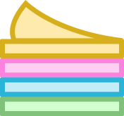
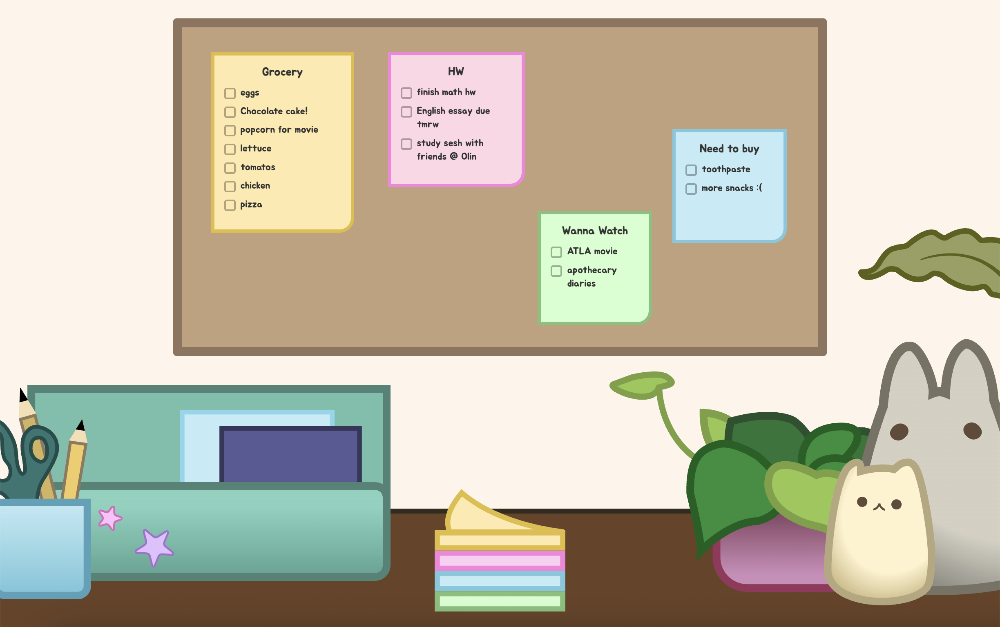
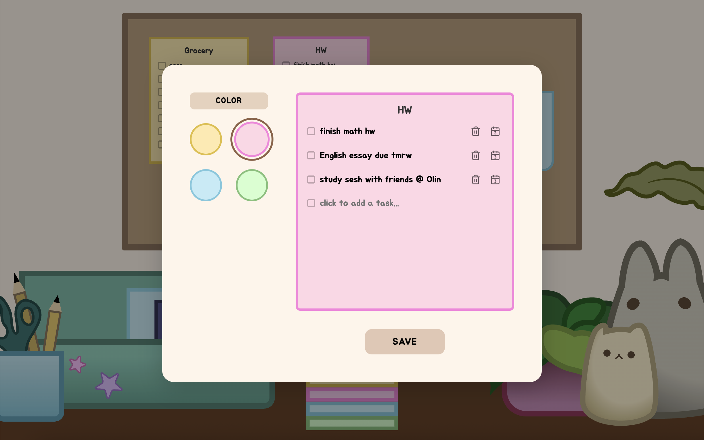

#  Mindi's Note Board 

A playful, desk-themed sticky note board built with React, inspired by my own workspace and the way I use sticky notes on my bulletin board as in-your-face reminders. So have fun! Create notes, drag them onto the board, check off tasks, add reminders to Google Calendar, resize notes, and drag them off the board when you're done.

**Try it out! ➛** [mindis-note-board.onrender.com](https://mindis-note-board.onrender.com/)

## Screenshots ⋆˚࿔

<table>
  <tr>
    <td></td>
    <td></td>
  </tr>
</table>

## Features ⋆˚࿔

- **Desk scene** with a bulletin board where notes live
- **Sticky notes** — 4 color themes, drag to reposition (mouse & touch), resize via corner handle (desktop only), drag off the board to delete
- **Note editor modal** — color picker, live preview, task checklist, one-click add-to-Google-Calendar for any task
- **Responsive** — modal and layout adapt for narrow/mobile screens
- **Zero-Login Canvas**: No tedious registration forms or signup friction. You land on a blank, personal workspace instantly.

## Tech Stack ⋆˚࿔

- **Containers & Virtualization**: Docker, Docker Compose (Used to containerize and isolate the environment locally)
- **Frontend**: React (Hooks, Contexts, HTML5 Pointer Tracking, Viewport CSS)
- **Backend**: Node.js, Express
- **Database**: PostgreSQL (Hosted via Supabase)
- **Hosting**: Render

**Design:** all visual assets (icons and desk decorations) were designed in Figma.

## Project Structure ⋆˚࿔

```
src/
├── assets/                 # icons + desk decoration illustrations
├── components/
│   ├── StickyNote.jsx      # drag, resize, tasks, delete-by-drag
│   └── NoteModal.jsx       # create/edit modal
├── App.jsx                 # board layout, note state, desk scene
└── App.css                 # styling + mobile responsiveness
```

## Notable Implementation Details ⋆˚࿔

- **Drag & resize**: notes are positioned in percentages relative to the board, so they scale with it. `mousemove`/`touchmove` listeners attach to `window` (not the note) so fast drags aren't lost.
- **Calendar icon** always shows the accurate current day.
- **Resizing is desktop-only** — no touch handler on the resize handle.
